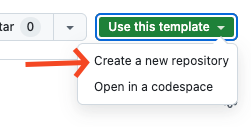

# InboxDesign Exercise Project

This project requires `node@20.19.x`, `yarn`.

Execute `yarn dev` to run the project.

## Requirements

Please create the following features using JavaScript (vanilla).

1. Load todo list.
2. Add items.
3. Complete items.
3. Delete items.

API endpoints: [https://dummyjson.com/docs/todos](https://dummyjson.com/docs/todos)

All actions should have clear feedbacks and error handling.

Use `axios` to handle http requests. Or choose whatever packages you feel comfortable with.

## Steps

Go to [https://github.com/InboxDesignNZ/inboxdesign-exercise-react-js](https://github.com/InboxDesignNZ/inboxdesign-exercise-react-js)

